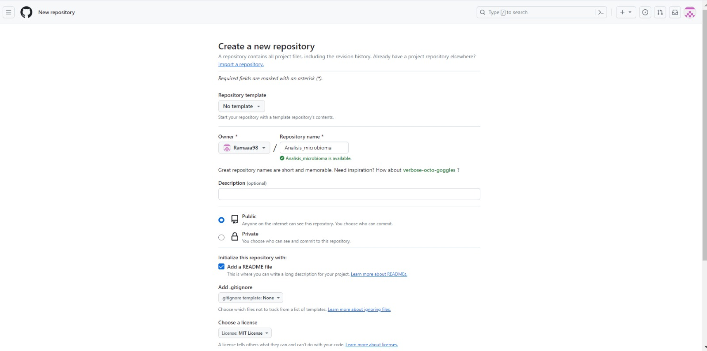

# Máster Bioinformática. UNIR
# ACTIVIDAD GRUPAL INTRODUCCIÓN A LA PROGRAMACIÓN
# Análisis_microbioma
Usuarios del repositorio: Ignacio Capelo Gimenez, Rama Hafian Al-Homsi, Alberto Meca Zapata.

El repositorio creado se utilizará para la creación de la actividad grupal de la materia Introducción a la programación científica. Donde se subirá el procedimiento para el análisis de datos de microbioma. Los datos utilizados serán los proporcionados en la Actividad 2 de Secuenciación y Ómicas.

# **Para la creación del siguiente repositorio se han seguido los siguientes pasos:**
1. Creación del repositorio de dominio público y la posterior adición de los colaboradores
   
2. Clonación del repositorio en dispositivo local.
3. Creación de los directorios necesarios.
4.  Sincronización del repositorio

## La actividad utilizad

# Para ello se seguirá la siguiente estructura: 
  1. Descarga de secuencias
  2. Artefacto qiime2 con las secuencias
  3. Demultiplex y filtrado
  4. Revisión de calidad y denoising
  5. Árbol para el análisis de diversidad filogenética
  6. Cálculo de la diversidad alfa y beta
  7. Análisis permanova y gráfico PCA
  8. Análisis taxónomico

1. Descarga de secuencias:
   
   

